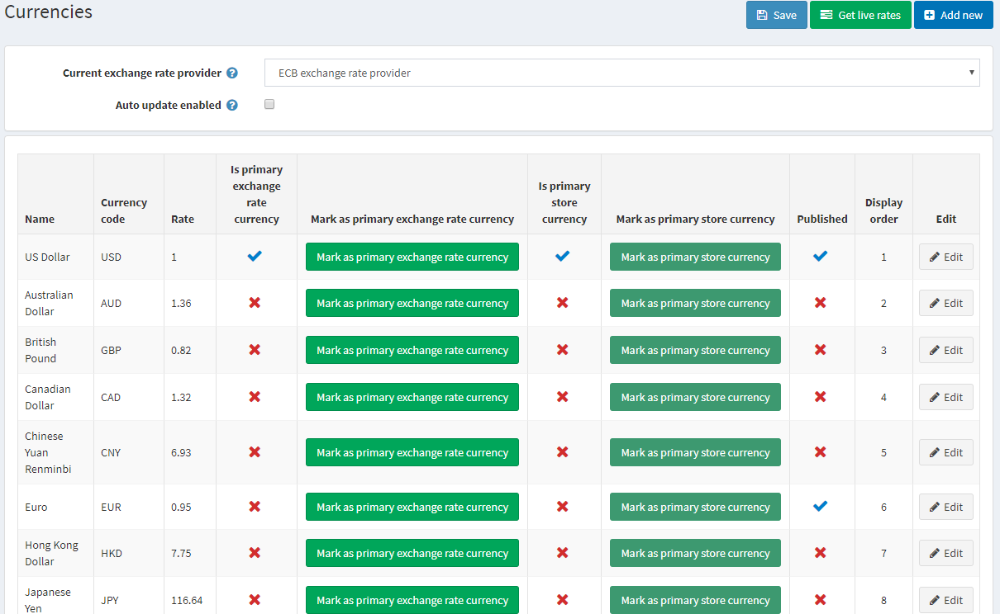
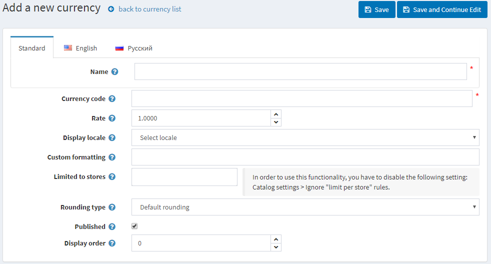
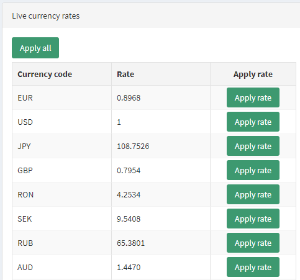

# Currencies

In nopCommerce, **only primary store currency is used,** which is the currency against which all other allowed currencies will be configured. Although nopCommerce allows having multiple currencies for displaying your product prices, the primary currency is used for payment transactions with online payment gateways.

If you are using **an online payment gateway** (such as PayPal, Google Checkout) the amount is sent to the payment gateway and will be the price you entered in primary store currency.

Primary store currency is used only by the store administrators. It is used for setting product prices and does not have to be the same as the published currencies.

If you have only one published currency, the store will not display a currency selector, or any currency symbol with prices. If more than one currency is published, all prices are marked with the currently selected currency. nopCommerce recommends removing any currency that is not required.

nopCommerce uses an **exchange rate** to calculate the amounts for published currencies. The exchange rate is entered when a currency is added or edited. Alternatively, you can use a **real-time exchange** rate service to calculate the amount, and the price of the product is multiplied by the exchange rate provided.

Exchange rates fluctuate on a daily basis. Therefore, you can edit the exchange rate as often as you need in order to stay current. Actual transactions are only handled in your store's primary currency. On credit card transactions, banks will usually make exchanges automatically based on the most current currency values.

To define **currency settings** go to **Configuration → Currencies.**

From the Current exchange rate provider dropdown list, select the exchange rate provider that will be used to get live rates.

> [!NOTE]
> By default in nopCommerce there is only one exchange rate provider available - ECB. To get live rates from ECB you should select EUR as a primary exchange rate currency.

 Select the **Auto update** enabled checkbox, to enable receiving **an automatic update of currency rates every hour.**

> [!NOTE]
> By default, all the currency rates are updated once per hour. You can change currency rates updating settings in System → Schedule task, choose Update currency exchange rates.

 Click **Save.**

## Adding new currency

Click **Add new** button.

Define the **currency settings:**

* Currency **Name.**
* Currency **code.**
* Enter the **exchange Rate** against the primary exchange rate of the currency.
* From the **Display locale** dropdown list, select the display locale for currency values.
* Enter **Custom Formatting** to be applied to the currency values. In this field, you can specify any symbols for the currency displaying in public store, number of decimal places and so on.
* In the **Limited to Stores** select a pre-created store from drop-down list
* From the **Rounding type** drop-down list choose one of the types of rounding:
  * Default rounding
  * Rounding up with 0.05 intervals (0.06 round to 0.10)
  * Rounding down with 0.05 intervals (0.06 round to 0.05)
  * Rounding up with 0.10 intervals (1.05 round to 1.10)
  * Rounding down with 0.10 intervals (1.05 round to 1.00)
  * Rounding with 0.50 intervals
  * Rounding with 1.00 intervals (1.01-1.49 round to 1.00, 1.50-1.99 round to 2.00)
  * Rounding up with 1.00 intervals (1.01–1.99 round to 2.00)
* Select the **Published** checkbox, to enable this currency to be visible and selected by visitors in your store. nopCommerce supports a multi-currency pricing display. If you have several published currencies, customers will be able to select the currency they want.
* In the **Display order** field, enter the display order of this currency. A value of 1 represents the top of the list.
* Click **Save.**

Click **Get live rates** in the Currencies window. The window is expanded as follows:

You can **check all the rates** here and **apply manually new rates for all the needed currencies.**
