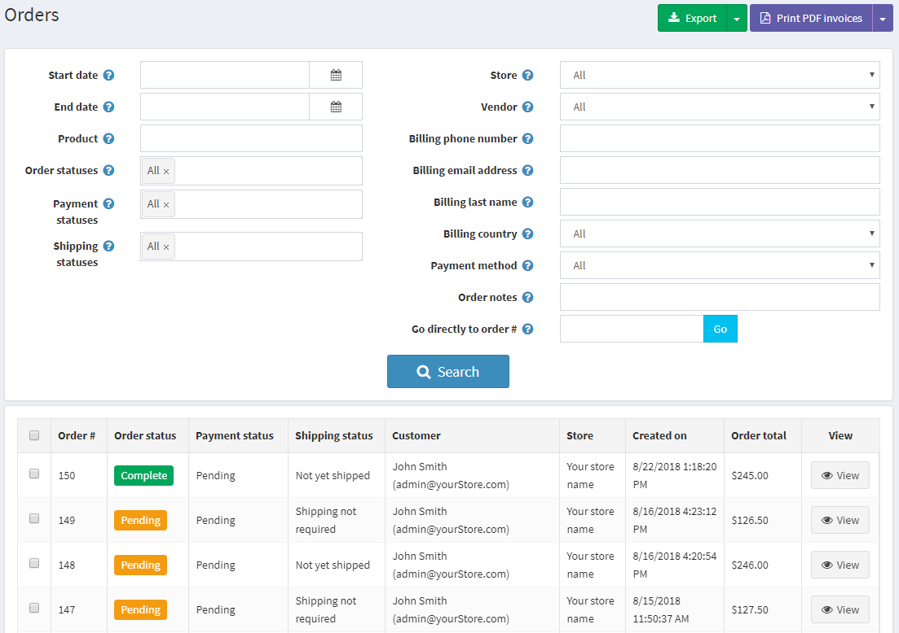
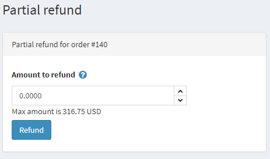
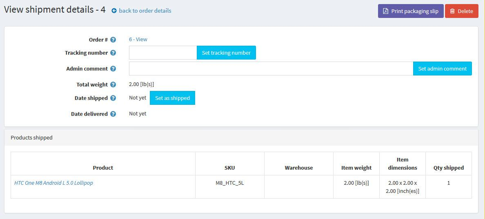
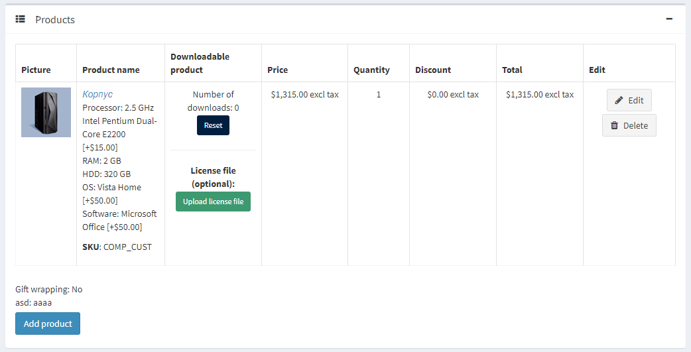

# Order management

**To view and manage Orders**, go to **Sales → Orders**. The Orders page lists all current orders. After a customer completes a transaction, a new order appears on the orders page.

Top area of the page enables a store owner to search for orders. Enter specific search criteria and use a variety of filters to find any order placed in the store. When any search is performed, the results of the search are displayed in the lower half of the screen.  You can click View to view the order details.

__To search for orders__, enter one or more of the following search criteria:

* **Start date** and **End date** to define a period of orders creation
* **Product** - enter a product name
* **Order status** - select one of the follows: All, Pending, Processing, Complete, Cancelled
* **Payment status** - select a specific payment status to search by: All, Pending, Authorized, Paid, Refunded, Partially Refunded, Voided
* **Shipping status** - select a specific shipping status to search by: All, Shipping not required, Not yet shipped, Partially shipped, Shipped, Delivered
* **Store** - set a specific store in which orders were placed
* **Vendor**
* **Billing phone number** - customer’s phone number
* **Billing email address** - customer’s email address
* **Billing last name** - customer’s last name
* **Billing country**
* **Payment method**  - set a specific payment method that was used during checkout
* **Order notes**
* **Go directly to order number** - enter the order number and click Go to display the required order

> [!NOTE]
> You can export the order data to an external file by clicking Export to XML(all) or Export to Excel (all). You can export selected order data to an external file by clicking Export to XML(selected) or Export to Excel (selected).

**To view the order full information**, click **View** beside the order in the list.

Click the **Invoice (PDF)** button in the right top corner to generate an invoice of the order in PDF form. Click **Delete** if you want to delete the order.

On the **Order Info** tab a store owner can perform the following:

* View the **Order Status**. The Order Status will be *Completed* only once the payment status is set to *Paid* and the Shipping status is set to *Delivered*. The order status can be changed manually by clicking the **Change status** button. However, this option is recommended only for advanced users, all appropriate actions (such as inventory adjustment, sending notification emails, reward points, gift card activation/deactivation, etc) must be performed manually in this case.
* **Cancel order**. A confirmation message is displayed, click OK to remove the order from the system.
* View the order’s ID, GUID, Store, Customer email and IP, payment details (including discounts, taxes, profit and more)
* **Edit order totals**. Note: when a customer used the Manual Credit Card payment method, which enables storing credit card information in the database, a button Edit credit card becomes visible. If a different payment method is used, this button will not be visible.
* View the **payment status**. Might be one of the following: Pending, Authorized, Paid (Captured), Refunded, Partially Refunded, or Voided. Note: not all of the gateways support all of these statuses.

If the payment status is **Authorized** the relevant buttons will be available to **Void** and **Capture** the order. Capture is used to collect the funds from the customer. Void cancels an order that has not been captured. If the Payment status is **Pending**, the owner can click **Mark as paid** to indicate a payment has been issued for the order. If the payment status is **Paid** a **Partial Refund** button will be available. Clicking this button displays the Partial Refund window, enabling the owner to refund part of the total order, as follows:

On the **Billing & Shipping panel**, view and edit the billing and shipping information, if needed. On the **Shipping Info panel**, a store owner can:

* View and Edit a **shipping address**. Optionally you can click the** View address on Google maps** link to locate the required shipping address.
* View and Edit a **shipping method**
* View a **shipping status**. Note: Store owners can create several shipments per order. If you create a shipment but do not ship all products, then the shipping status of an order is **Partially shipped**. Once all the products are shipped, the status changes to **Shipped**. Once all the shipments are delivered, the status changes to **Delivered**.
* View the **list of shipments**. Click **View** beside the shipment to view its details. The shipment information window will be displayed:
    

**Add Shipment** - enables creating several shipments per order and is visible when there is at least one non-shipped product in the order. Add a new shipment in the Add a new shipment to order window. In the Quantity to ship column, enter the required quantity of the specific order to ship. Once a shipment is created, you can set it to shipped and then delivered, by clicking the Set as shipped and Set as delivered buttons accordingly.

In the **Tracking number** field, enter the tracking number of the current order and click the Set tracking number button. Tracking numbers enables your customers and you to check up on the progress of a shipment via a telephone or online system, operated by your shipping agent (the Post Office, or a private courier service such as FedEx or UPS). When a shipment passes certain points along its route, it is identified by the shipping agents system, and the tracking database is updated with the new location and time information.

On the *Products* tab a store owner can:

* **View the product information**, including price, quantity, and total price
* Click the Product name link to **view a product detail page** or the Download link to **download a product** if it is downloadable, alternatively, a user can upload a file to the downloadable product. In addition, when the Download activation type of a product is set to Manually, an administrator has the option to click **Activate** to enable **downloading** the product from the site or **Deactivate** to disable **downloading** the product from the site
* **Edit** the product **price**, **quantity**, **discount** and **total**
* **Delete** a product from the system
Add Product. In the **Add a New Product to the Order** window find the required product, fill the required values and Add Product.

On the **Order Notes** tab, a store owner can **view** notes that were added to each order for information purposes, **delete** notes, and **add new** notes, which may contain an attached file and be Displayed to a customer in a public store.

## See also

* [Adding products](xref:en-US/user-guide/running/product-management/products/adding-products/index)
* [Shipments](xref:en-US/user-guide/running/order-management/shipments)
* [YouTube tutorial on managing orders](https://www.youtube.com/watch?v=z6TUJOO3gVg&index=5&list=PLnL_aDfmRHwsbhj621A-RFb1KnzeFxYz4)
