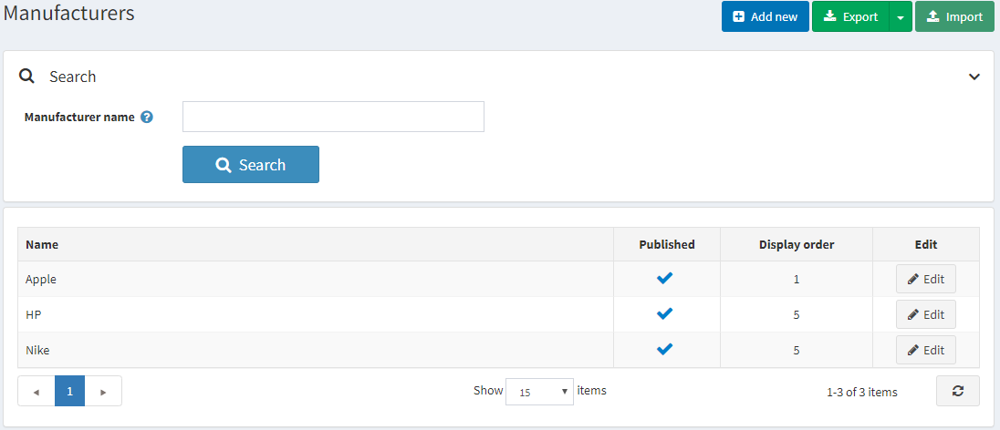
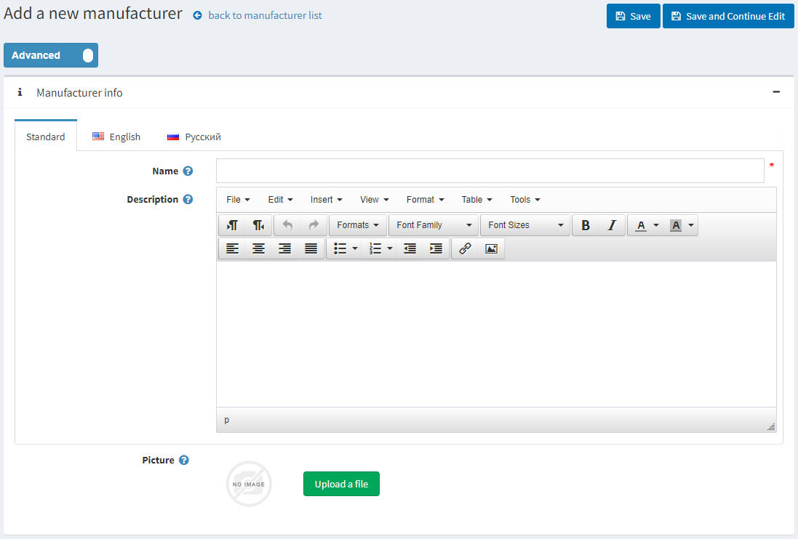
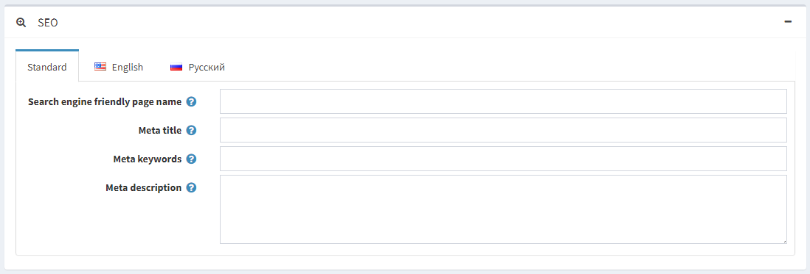

# Manufacturers

To manage manufacturers go to **Catalog → Manufacturers.**



**Search** for a manufacturer in the Manufacturers window by **entering the Manufacturer name** (or a part of the name), or among all the manufacturers of a certain Store.

Click the **Edit** button to edit the manufacturer’s details.

## Adding new manufacturers



In the **Manufacturer Info panel**, define the following **details**:

- **Name**.
- **Description** - description of the manufacturer. Use the editor for layout and fonts.
- **Picture** - an image, or a logo, representing the manufacturer. Upload the image from your device.

### Display


In the **Manufacturer Display panel**, define the following **details**:

- Select the **Published** checkbox, to enable the manufacturer to be visible in the public store.
- Select the **Allow customers to select page size** checkbox, to enable customers to select a page size, i.e. the number of products displayed on the Manufacturer Details page. The page size can be selected by customers from the page sizes list entered by the store owner in the Page size options field.
- When this option is disabled, customers will not be able to select a page size on the Manufacturer Details page and the store owner enters a certain page size. In this case, the Page size field becomes visible in the Administration area.

> [!TIP]
> For example, when you add seven products to a manufacturer and you set its page size to three. Three products per page will be displayed on this manufacturer details page in the public store, and the total amount of pages will be three.

- **Price ranges** - allow defining ranges of price by which customers can filter the manufacturers. Enter a price range in the currency that you defined in the Currencies window. Separate the ranges by a semicolon, for example, 0-999; 1000-1200; 1201 - (1201 means 1201 and over).
- **Display Order** - the order number for displaying the manufacturer. This display number is used to sort manufacturers in the public store (ascending). The manufacturer with the display order 1 will be placed at the top of the list.

### Mappings


In the **Manufacturer Mappings panel**, define the following **details**:

- **Discounts** - select all discounts associated with this manufacturer. Discounts can be created in the [Promotions](xref:en-US/user-guide/marketing/promotional/index) menu. Note that only discounts with Assigned to categories type are visible here. After discounts are mapped to the manufacturer, they are applied to all products of this manufacturer.
- **Limited to customer roles** option allows showing this manufacturer only to selected customer roles. Choose the required customer roles from the list that can be created/edited on the [Customer roles](xref:en-US/user-guide/configuring/settingup/customers/customer-roles) page of the Customers menu. If you want the manufacturer to be visible to all - leave the field empty.
- Select the **Limited to stores** option to make this manufacturer limited to one or more stores. Note that this checkbox is only used when you have several stores configured. For further details refer to [Multi-store support](xref:en-US/user-guide/configuring/settingup/mainstore/multiple-store).

### Setting up SEO



In the **SEO panel**, define the following **details**:

- **Meta keywords** - manufacturer keywords, which are a brief and concise list of the most important themes for the page. Meta keywords tag will look like: `<meta name="keywords" content="keyword, keyword, keyword phrase, etc.">`

- **Meta description** - a description of the manufacturer. The meta description tag is a brief and concise summary of your page content. The meta description tag looks, as follows: `<meta name="description" content="Brief description of the contents of your page">`

- **Meta title** specifies the title of your Web page. It is a code which is inserted into the header of your web page:

```html
<head>
    <title> Creating Title Tags for Search Engine Optimization & Web Usability </title>
</head>
```

- **Search engine friendly page name** - the name of the page used by search engines. If you leave the field blank, then the category page URL would be formed using the manufacturer name. If you enter custom-seo-page-name, then the following custom URL will be used: `http://www.yourStore.com/custom-seo-page-name`

### Adding products to certain manufacturer

**Products panel** contains a list of products related to the selected manufacturer. The store owner can add new products to this manufacturer. Note that you need to Save the manufacturer before you can add products.

Click **Add a new** product to find a product you want to add to this manufacturer. You can search by the product Name, by a Store, or a Product Type.


Select a product you would like to add to the manufacturer and click the **Save** button. The product will be displayed under the selected manufacturer.

After the product was added to the manufacturer, define the following information in the Products panel:

- **Is featured product**.
- **Display order.**
- By clicking **View**, you will be transferred to the Edit Product Details page.

Click **Save**. The new manufacturer will be displayed in the public store.

You can click **Delete** to remove the manufacturer.

You can **export** the manufacturer settings to an external file for backup purposes, by clicking the Export button.

## See also

- [Adding products user](xref:en-US/user-guide/running/product-management/products/adding-products/index)
- [SEO](xref:en-US/user-guide/marketing/content/seo)
- [Video tutorial: managing](https://www.youtube.com/watch?v=NnWD9-zi8s4&feature=youtu.be)
