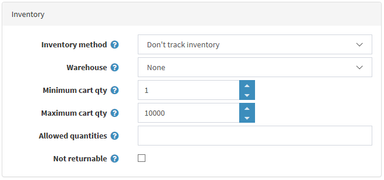
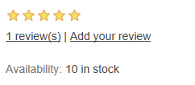
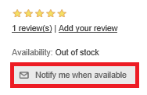
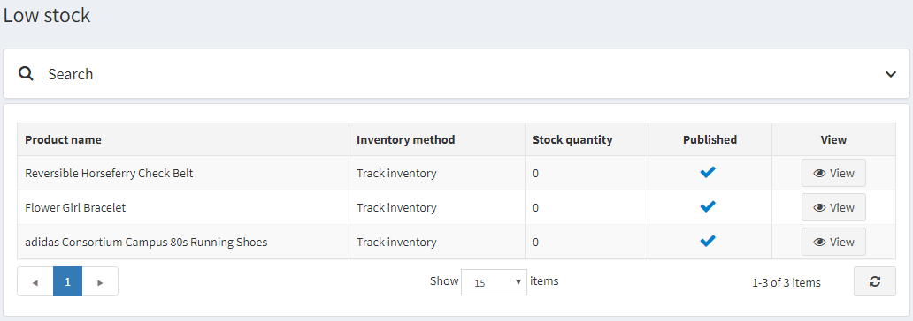

# Inventory management

Inventory management is a system of stock level controlling. In nopCommerce it consists of setting up the Inventory and tracking low stocks.

**To set up inventory**, go to **Catalog → Products → Edit a product**. In the Edit product details window, on the **Product info tab** go to **Inventory section**.

Some products may not require inventory tracking. For example, services, second hand or custom-made goods. In this case, a store owner can opt for no tracking, by choosing Don’t track inventory option in the Inventory method field. In this case, the owner can define a **warehouse**, **minimum** and **maximum cart quantities**, **allowed quantities**, i.e. instead of a quantity text box customers will see a drop down list with predefined quantity options, and set a product as **not returnable**.

In case an inventory tracking is required, the shop owner can select an **inventory method** between two options: **track inventory (by product)** or **track inventory by product attributes**. The first option is for those who don’t have product variants, and simply need to know how many items are left. In case of the tracking by attributes, inventory is managed for product attributes’ combinations.

Once the **Track inventory** method is chosen, the section expands displaying new fields.

* Tick the **Multiple warehouses** checkbox if you want to support shipping and inventory management from multiple warehouses. This way you can manage inventory per warehouse:
  * "Stock quantity" is the total quantity. It is reduced every time when an order is shipped.
  * "Reserved qty" is product quantity that is ordered but not shipped or added to a shipment yet.
  * "Planned qty" is product quantity that is ordered and already added to a shipment but not shipped yet.

  
* If there is only one warehouse (Multiple warehouses unticked), from the **Warehouse** drop down list, select the warehouse which will be used when calculating shipping rates. For further details refer to the Warehouses page.
* To prevent customers from placing orders and finding out that the product is out of stock, you can take certain actions. Tick the **Display availability** checkbox, to display stock availability in the public store, and, if required, the **Display Stock Quantity** checkbox, to enable customers to see a product stock quantity on the product details page (this checkbox is displayed only when the **Display availability** checkbox is ticked).

  
* In the **Minimum stock quantity** field, enter a minimum value, under which further actions will be taken.
* From the **Low stock activity** dropdown list, select the action to be taken when the stock quantity falls below the minimum stock quantity value, as follows:
  * **Disable buy button**: The buy button becomes disabled when stock is low. Therefore, customers cannot buy this product but can still see it existing in the store.
  * **Un-publish**: The product is not visible in the store anymore. Used when the product is going to be stopped entirely.
  * **Nothing**: Store owners can still choose to not take any action. It means that customers can continue to order products.
* In the **Notify for quantity below** field, enter a value under which a notification email will be sent to the administrator.
* Store owners can set up **backorders**, i.e. orders that can not be fulfilled at the moment of purchase. From the Backorders dropdown list, select the required backorder mode, as follows:
  * **No backorders**: customers can’t purchase this product when there is no stock available
  * **Allow qty below 0**: customers can purchase this product even when there is no stock available
  * **Allow qty below 0 and notify customer**: customers can purchase this product even when there is no stock available. In addition, they get a notification receiving the following message: Out of Stock - on backorder and will be dispatched once in stock (**Display availability** option should be also enabled in this case).
* Tick **Allow back in stock subscriptions**, to enable customers to subscribe for a notification about product availability

  
* Choose **Product availability range** will be displayed for customers when product is not available for the moment
* Define a **minimum** and **maximum cart quantities**, **allowed quantities**, i.e. instead of a quantity text box customers will see a drop down list with predefined quantity options
* Choose whether a product is **not returnable**

In case you have different product attributes combinations and need to track their stock quantity, select **Track inventory by product attributes** inventory method.

* Choose a **warehouse** which will be used when calculating shipping rates
* Tick the **Display availability** checkbox, to display stock availability in the public store, and, if required, the **Display Stock Quantity** checkbox, to enable customers to see a product stock quantity on the product details page (this checkbox is displayed only when the **Display availability** checkbox is ticked).
* Define a **minimum** and **maximum cart quantities**, **allowed quantities**, i.e. instead of a quantity text box customers will see a drop down list with predefined quantity options
* Tick **Allow only existing attribute combinations** to allow adding to the cart/ wishlist only existing attribute combinations with stock quantity greater than 0. In this case you have to create all product attributes combinations that you have in stock
* Choose whether a product is **not returnable**
* To set **stock quantity** for different attributes combinations go to the tab **Product attributes → Attribute combinations** on the Edit Product Details page. On the same tab you can define whether to **Allow out of stock** for a certain attribute combination to enable orders to be approved even when the product is out of stock.

  

**To track products** that are currently **under stock**, go to **Reports → Low Stock**.

The low stock report contains a list of products that are currently under stock, i.e. the stock quantity is equal or less than the minimum stock quantity set in the Inventory section of the Product info panel.

Click **Edit** to view the **Product info panel**, where these stock settings can be changed.

## See also

* [Product Attributes](xref:ru-RU/user-guide/running/product-management/attributes/product-attributes)
* [Warehouses](xref:ru-RU/user-guide/configuring/setting-up/shipping/warehouses)
