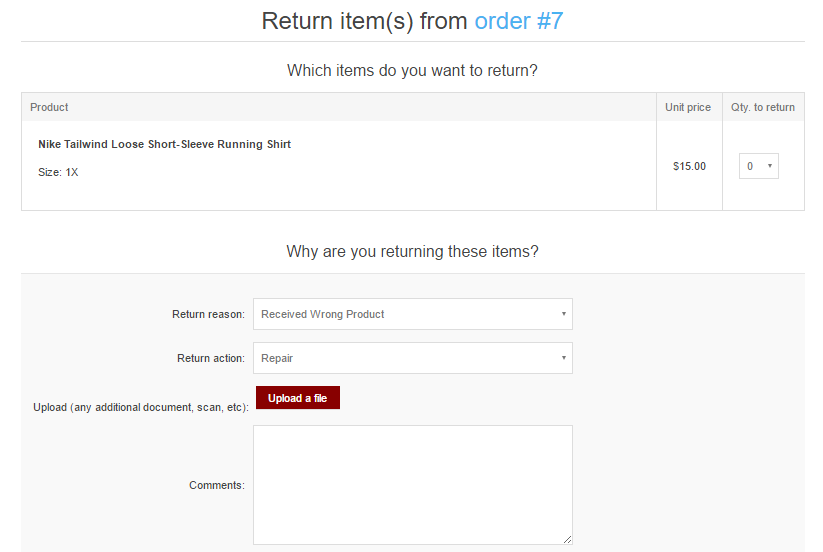
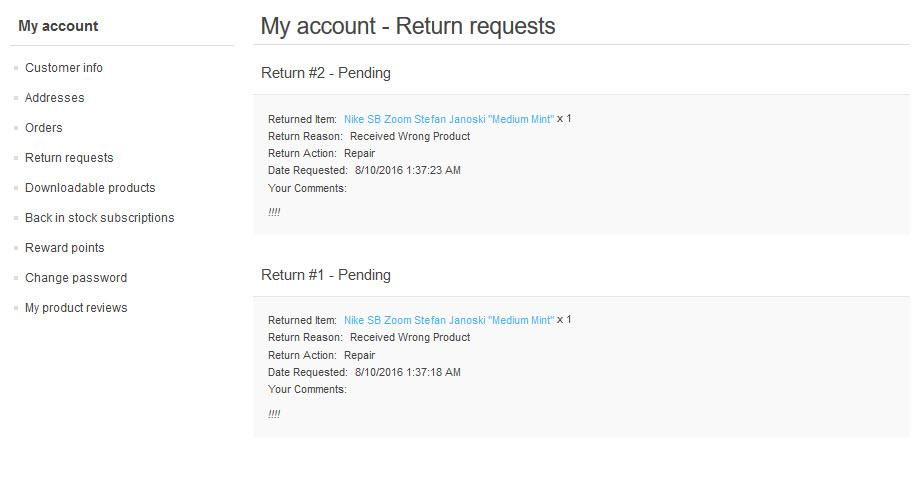
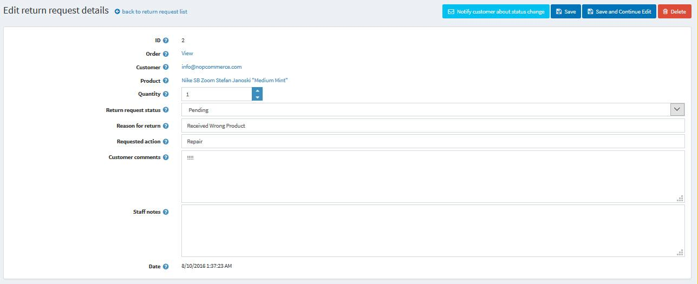

# Return Requests

Return Request feature enables customers to request a return on items previously purchased. This option is only available for completed orders. Return requests settings are managed in **Configuration → Settings → Order Settings on the Return Request settings tab**.

When this option is enabled, a **Return item(s)** button is displayed for completed orders on the order details page in the public store.

**To submit a return request**, a customer would need to take the following steps:

In the public store, go to the My Account window and click Orders, as follows:
  

1. Click the **Return Item(s)** button beside the complete order that is to be returned. The **Return Item(s) from Order #** is displayed, as shown in the following example:
    
    * **Qty. to return** dropdown list allows selecting the number of items to be returned.
    * **Return Reason** dropdown list allows selecting the reason for requesting a return. For example, wrong product ordered, wrong product received and more. These reasons are defined by the store owner in the Return Request Settings.
    * **Return Action** dropdown list allows selecting the required return action to take. For example, repair product, replace product, issue credit and so on. These actions are defined by the store owner in the Return Request Settings.
    * Choose the **Upload a file** option if you want to attach some additional documents, pictures to your request.
      > [!NOTE]
      > this option is available only when the checkbox **Allow file uploads** in **Configuration → Settings → Order Settings** on the **Return Request settings tab** is ticked.
    * In the **Comments** field, a customer can enter an optional comment for information purposes.
1. After using the Return Request feature, the customer can manage his/her requests from the **My Account** page in the public store, by clicking **Return Requests**:
    

    The store owner can now manage this return request in the Administration Area.

The store owner can now manage this return request in the Administration Area.

**To view and edit return requests**, go to **Sales → Return requests**. Click Edit beside the return request, the Edit Return Request window is displayed.

> [!NOTE]
> The Request ID, Product, and Date fields are read-only and cannot be edited.

* **Order link** allows viewing the associated order details page.
* **Customer link** allows viewing the customer details page.
* **Status** dropdown list allows to select the request status: In the **Reason for Return** field, edit the reason for return, if necessary.
  * Pending
  * Received
  * Return Authorized
  * Item(s) Repaired
  * Item(s) Refunded
  * Request rejected
  * Cancelled
* In the **Requested Action** field, edit the requested action, if necessary.
* In the **Customer Comments** field, edit the comment entered by the customer, if necessary.
* In the **Staff Notes** field, enter an optional note for information purposes.

> [!NOTE]
> Click the Notify customer about status change button to send an email to the customer informing him/her on the return request status change.
> 

## See also

* [Return request settings](xref:ru-RU/user-guide/running/order-management/return-requests/return-requests-settings)
* [Orders](xref:ru-RU/user-guide/running/order-management/orders/index)
* [YouTube Tutorial: Managing Return Requests](https://www.youtube.com/watch?v=VqF2GZ2ip_0&list=PLnL_aDfmRHwsbhj621A-RFb1KnzeFxYz4&index=17)
